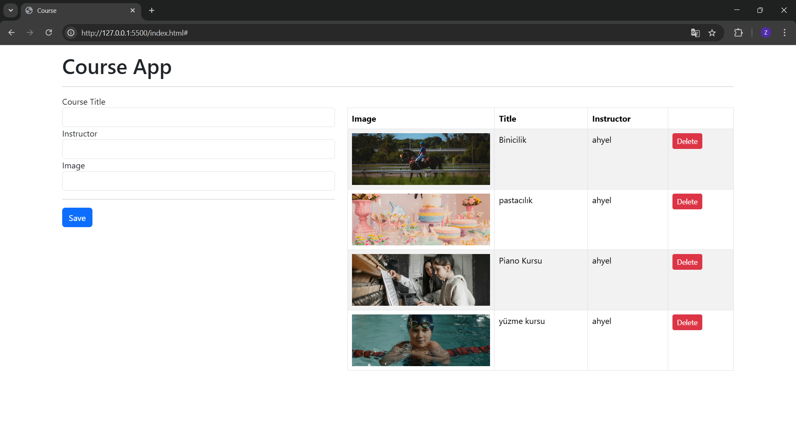
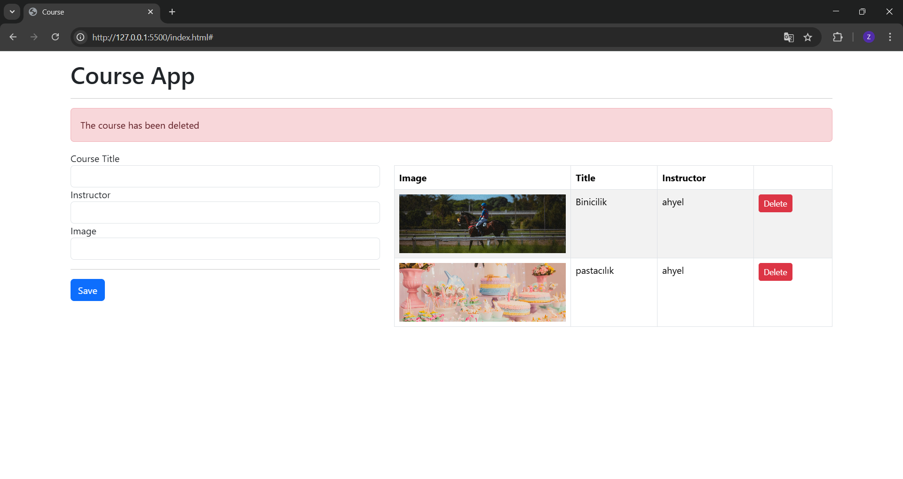
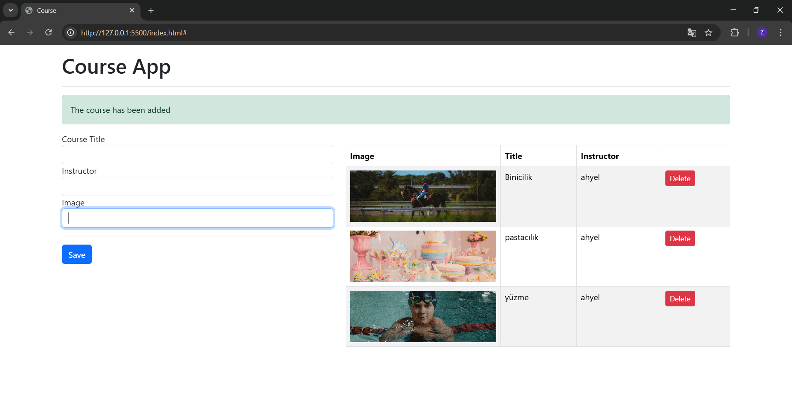
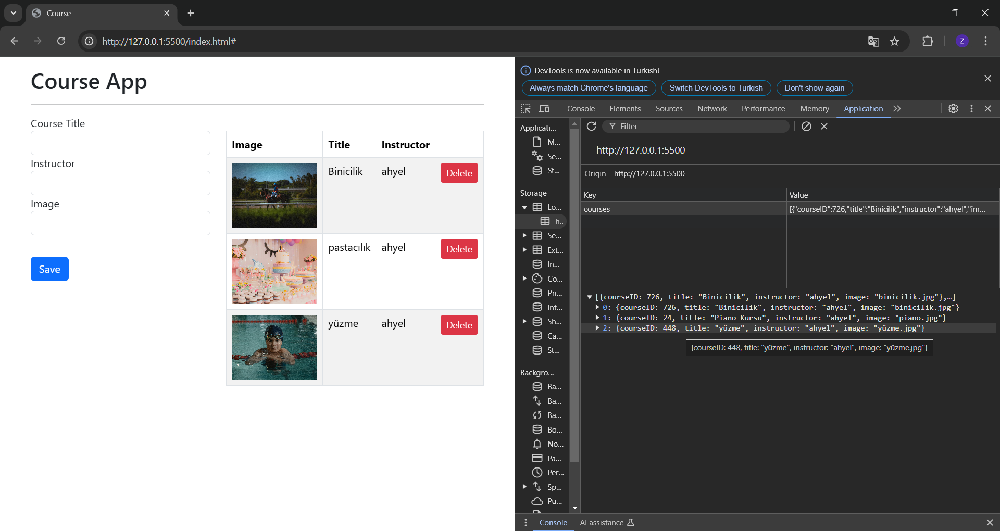

# Course App

Kullanıcıların kurs ekleyebileceği, silebileceği ve eklenen kursları görüntüleyebileceği basit bir uygulama.

## Proje Konusu

Bu proje, kullanıcıların kurs bilgilerini ekleyebileceği, listeden silebileceği ve verileri **localStorage** ile saklayabileceği bir **Kurs Uygulamasıdır**. Kullanıcılar kursların başlığını, eğitmeni ve görselini girerek listeye ekleyebilirler.

## Neden Geliştirildi, Motivasyon

Bu uygulamayı geliştirme motivasyonum: **web geliştime dair becerilerimi ilerletmek ve JavaScript üzerinde daha fazla deneyim kazanmak** istedim.

## Ne Öğrendim?

Bu projeyi geliştirirken aşağıdaki konularda bilgi ve deneyim kazandım:

- **HTML, CSS, JavaScript** kullanarak interaktif bir web uygulaması geliştirme.
- **DOM manipülasyonu** ile sayfadaki bileşenleri dinamik olarak güncelleme.
- **Event Listener'lar** ile kullanıcı etkileşimlerini yönetme.
- **ES6 Class yapısı** kullanarak daha düzenli ve modüler kod yazma.
- **LocalStorage** kullanarak verileri tarayıcıda saklama.
- **Bootstrap** ile responsive tasarım oluşturma.

## Ekran Görüntüleri

